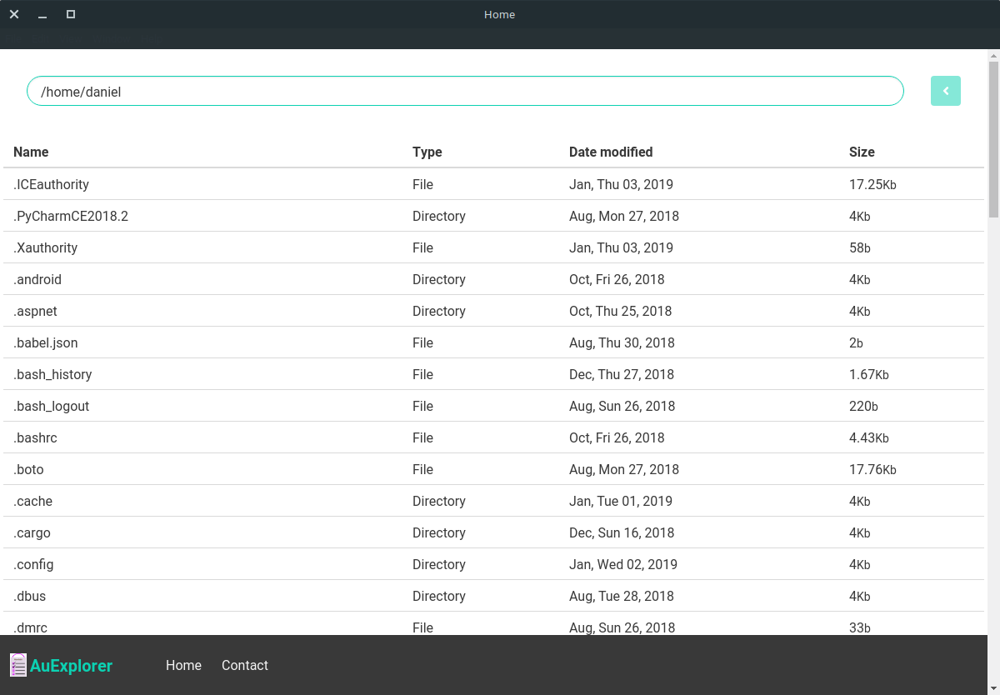

# AuExplorer
A small Proof of concept of an aurelia-script electron mixed app

```
pnpm install # or npm
pnpm start # or npm
```
Aurelia + Electron = :heart:


It's a small sample and was done quick and dirty but to me shows how easy is to get started with `aurelia-script`
since aurelia is based on conventions if you need to grow out of the single script, you will do that quite easy